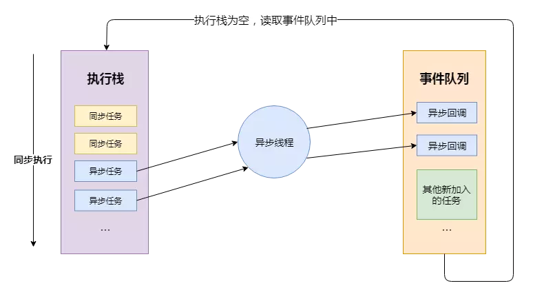
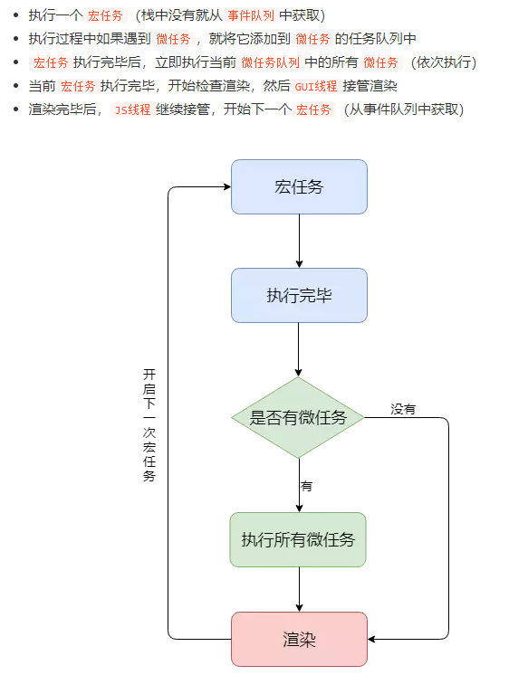

### 关于js的Event Loop

[参考文章](https://juejin.im/post/5d5b4c2df265da03dd3d73e5#heading-10)
* JS 分为同步任务和异步任务
* 同步任务都在JS引擎线程上执行，形成一个执行栈
* 事件触发线程管理一个任务队列，异步任务触发条件达成，将回调事件放到任务队列中
* 执行栈中所有同步任务执行完毕，此时JS引擎线程空闲，系统会读取任务队列，将可运行的异步任务回调事件添加到执行栈中，开始执行。

#### 宏任务与微任务

#### 什么是宏任务
 - 我们可以将每次执行栈执行的代码当做是一个宏任务（包括每次从事件队列中获取一个事件回调并放到执行栈中执行）， 每一个宏任务会从头到尾执行完毕，不会执行其他。

#### 什么是微任务
 - 当宏任务执行完，会在渲染前，将执行期间所产生的所有微任务都执行完

### 总结
